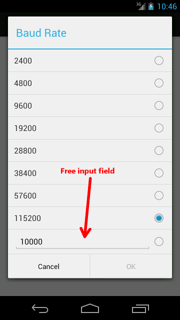
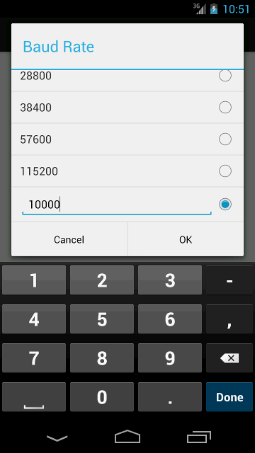

ListPreferenceWithEditText
==========================

**`ListPreferenceWithEditText`** is a drop-in replacement for Android's `ListPreference`. It acts like a typical `ListPreference`, but adds one selection option with an `EditText` field where users can specify any value. This is useful when there's a pre-defined set of values that are typically used, but users sometimes need to be able to specify custom values that are not part of that pre-defined set.

Here is an example:




##User Experience
Android’s `ListPreference` has only a "Cancel" button. `ListPreferenceWithEditText` on the other hand has both a "Cancel" and an "OK" buttons. Unless the custom field is selected, the "OK" button is disabled, and the operation is identical to a normal `ListPreference`. I.e. when the user selects an item from the list, that value is selected and the dialog is closed.

When the `ListPreferenceWithEditText` dialog is opened it looks quite similar to a normal `ListPreference` dialog. If the user selects the custom field, by touching anywhere in its line, the "OK" button is enabled, and the soft keyboard is displayed:



At this point the user can input text in the custom field, and then click the "OK" button. Note that at any time, even when the keyboard is shown, the user can scroll the list and select any value from the list by touching it. In this case, that value is selected, and the dialog is immediately closed.

##Usage
You should incorporate three files into your project:
`src/com/liorhass/ListPreferenceWithEditText.java`
`res/layout/list_preference_row_normal.xml`
`res/layout/list_preference_row_with_edit_text.xml`
Then you can use the `ListPreferenceWithEditText` class just as you would use Android’s build-in `ListPreference`.

Here is an example of res/xml/preferences.xml file that contains a `ListPreferenceWithEditText`:

```xml
<PreferenceScreen xmlns:android="http://schemas.android.com/apk/res/android">

    <com.liorhass.ListPreferenceWithEditText
        android:key="pref_baudrate"
        android:title="@string/pref_baudrate_title"
        android:dialogTitle="@string/pref_baudrate_title"
        android:entries="@array/pref_baudrate_titles"
        android:entryValues="@array/pref_baudrate_values"
        android:defaultValue="@string/pref_baudrate_default"
        android:descendantFocusability="afterDescendants"
        />

</PreferenceScreen>
```

The two layout files - `list_preference_row_normal.xml` and `list_preference_row_with_edit_text.xml` define the layout of the rows in the preference dialog. Here are these two files:

res/layout/list_preference_row_normal.xml:

```xml
<LinearLayout xmlns:android="http://schemas.android.com/apk/res/android"
    android:layout_width="fill_parent"
    android:layout_height="fill_parent"
    android:orientation="horizontal"
    android:paddingTop="6dp"
    android:paddingBottom="6dp"
    android:paddingLeft="12dp"
    android:paddingRight="10dp"
    >
    
    <TextView
        android:id="@+id/custom_list_view_row_text_view"
        android:layout_width="0dp"
        android:layout_height="wrap_content"
        android:layout_weight="1"
        android:gravity="center_vertical"
        android:textSize="16sp"
        />

    <RadioButton
        android:id="@+id/custom_list_view_row_radio_button"
        android:layout_width="wrap_content"
        android:layout_height="wrap_content"
        android:checked="false"
        />

</LinearLayout>
```

res/layout/list_preference_row_with_edit_text.xml:

```xml
<LinearLayout xmlns:android="http://schemas.android.com/apk/res/android"
    android:layout_width="fill_parent"
    android:layout_height="fill_parent"
    android:orientation="horizontal"
    android:paddingTop="6dp"
    android:paddingBottom="6dp"
    android:paddingLeft="12dp"
    android:paddingRight="10dp"
    android:descendantFocusability="afterDescendants"
    >

    <!-- A hack for KitKat: In KitKat the EditText gets the focus when the dialog
         is drawn. We put this dummy View here to get the focus instead, because
         we want the EditText to get the focus only if/when the user touches it. -->
    <View
        android:focusable="true"
        android:focusableInTouchMode="true"
        android:layout_width="0px"
        android:layout_height="match_parent"
        />

    <EditText
        android:id="@+id/custom_list_view_row_edit_text"
        android:layout_width="0dp"
        android:layout_height="wrap_content"
        android:layout_weight="1"
        android:textSize="16sp"
        android:inputType="number"
        />

    <RadioButton
        android:id="@+id/custom_list_view_row_radio_button"
        android:layout_width="wrap_content"
        android:layout_height="wrap_content"
        android:checked="false"
        />
</LinearLayout>
```

Note the attribute `android:inputType="number"` in the `EditText` tag. Obviously you should set this attribute to whatever suits your need. In this example, since the preference is a baud-rate value, the input type is set to “number”.

The values and titles of the preferences list are defined as usual with resource arrays. Note that you must add an item to each one of these arrays for the custom-input field. In the titles array this is just a placeholder, but it must be defined nonetheless. In the values array this is the default value of the custom field.
Here is an example of the file `res/values/arrays.xml`:
```xml
<resources>
    <!-- Baudrate ListPreference -->
    <string-array name="pref_baudrate_titles">
        <item>@string/baudrate_2400</item>
        <item>@string/baudrate_4800</item>
        <item>@string/baudrate_9600</item>
        <item>@string/baudrate_19200</item>
        <item>@string/baudrate_28800</item>
        <item>@string/baudrate_38400</item>
        <item>@string/baudrate_57600</item>
        <item>@string/baudrate_115200</item>
        <item>place_holder_for_custom_baud_field</item>
    </string-array>
    <string-array name="pref_baudrate_values">
        <item>2400</item>
        <item>4800</item>
        <item>9600</item>
        <item>19200</item>
        <item>28800</item>
        <item>38400</item>
        <item>57600</item>
        <item>115200</item>
        <item>10000</item> <!-- Default value of custom-baud field -->
    </string-array>
</resources>
```


##License
Copyright (c) 2014 Lior Hass

Licensed under [the MIT license](LICENSE).


